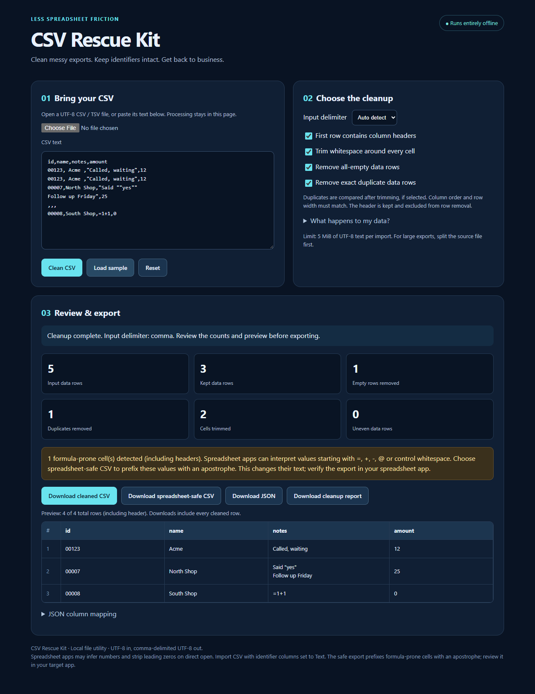

# CSV Rescue Kit

An original offline CSV cleanup utility for business exports.

**[Try the 100-row browser demo](https://csv-rescue-kit-20261002.samgelosh.chatgpt.site/#demo)** · **[Buy the offline commercial kit — $19 USD once](https://buy.stripe.com/3cIeVcewDbLl1D27hs7wA0d)**

The app trims whitespace, removes all-empty rows and exact duplicate rows, preserves string identifiers, handles quoted fields and multiline cells, and exports clean CSV, spreadsheet-safe CSV, JSON, and a cleanup report. CSV content stays in the browser.

The paid ZIP includes a self-contained HTML app, original source, parser tests, examples, instructions, and a perpetual license for personal use and commercial internal business operations. It handles UTF-8 files up to 5 MiB without the demo's 100-row limit. No install or subscription is required.

The browser demo and screenshots help you evaluate it before purchase. The commercial package is delivered after Stripe confirms payment. Bookmark the private order page returned by checkout for later downloads.

## Try a realistic export

1. Open the [browser demo](https://csv-rescue-kit-20261002.samgelosh.chatgpt.site/#demo).
2. Click **Load sample**, then **Clean CSV**. The synthetic sample has five data rows: one empty row and one exact duplicate are removed, leaving three.
3. Review the preview and cleanup counts. The identifiers `00123`, `00007` and `00008` stay strings. Export JSON to inspect those strings without spreadsheet type inference.
4. Compare normal and spreadsheet-safe CSV on the sample's `=1+1` text. Safe export prefixes it with an apostrophe, which changes the text.

The [100-row evaluation download](https://github.com/samgelosh-create/csv-rescue-kit-20261002/releases/tag/demo-v1) also works offline. It is a trial of the same cleanup workflow. The $19 commercial package includes the full 5 MiB app, development files, examples, instructions and the commercial internal-use license.

## Review exports before use

All values stay strings; spreadsheet applications may still infer numeric types when opening CSV. Import identifier columns as Text. Spreadsheet-safe export adds apostrophe prefixes to formula-prone text, including negative numbers; inspect the result in your spreadsheet program. Automatic delimiter detection is heuristic.

The original [CSV cleanup checklist](https://csv-rescue-kit-20261002.samgelosh.chatgpt.site/csv-cleanup-checklist) walks through a small before-and-after example. It explains when trimming and exact deduplication are appropriate, how to keep an untouched copy, and what to review before importing the result. The example was checked against the kit's parser.

## What is in this repository

This is the public product listing with synthetic sample files. The commercial ZIP is delivered through checkout. No customer data, credentials or private order records are included.
